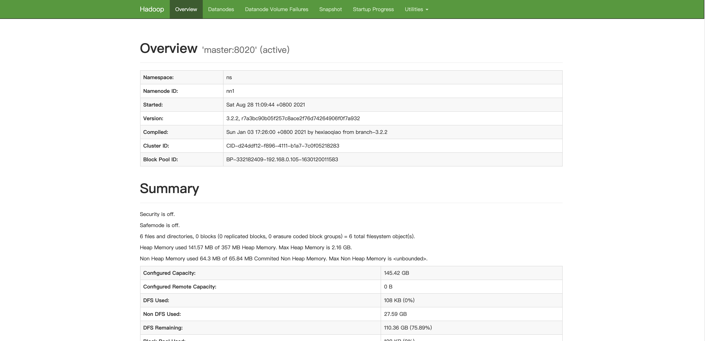
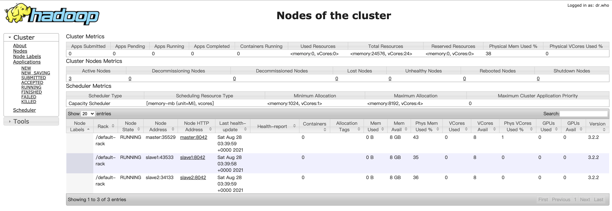
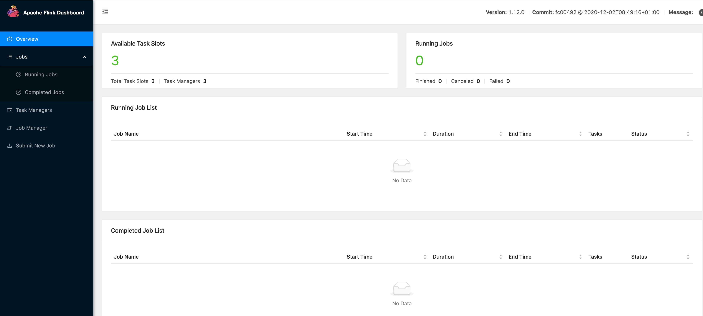
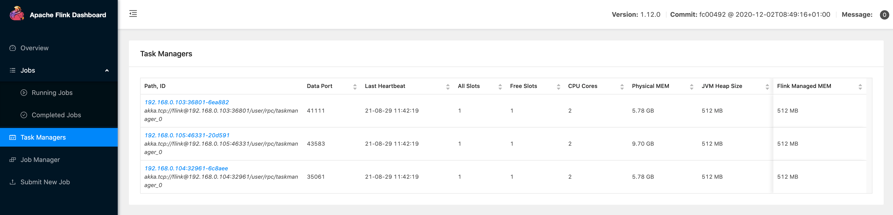
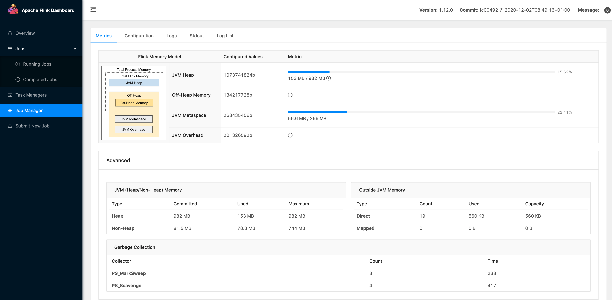
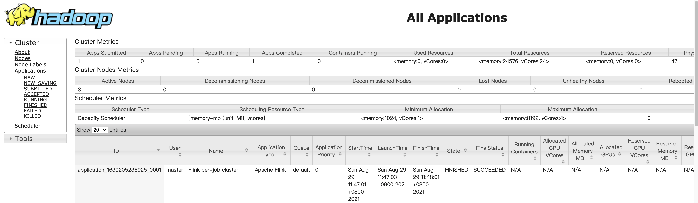
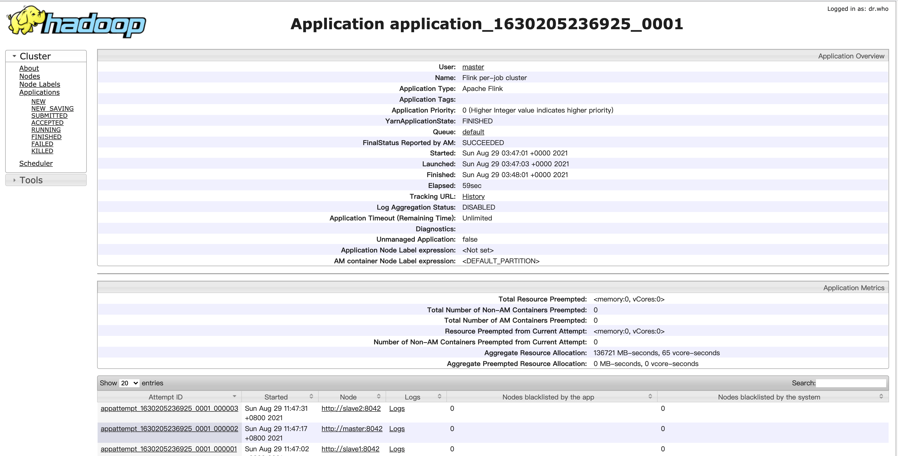
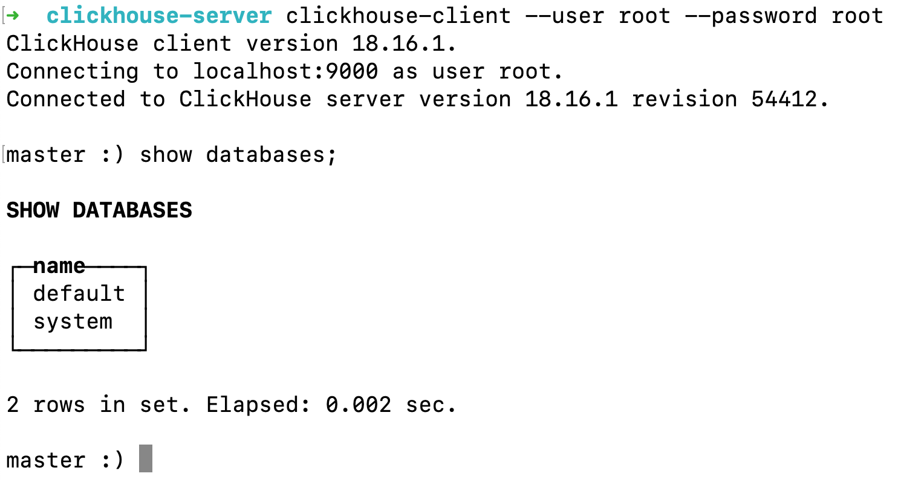
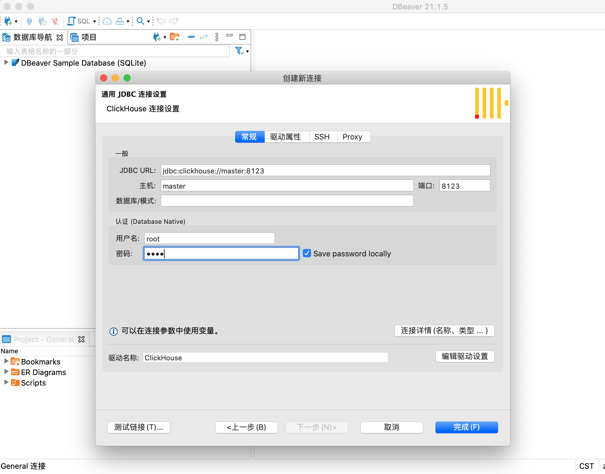
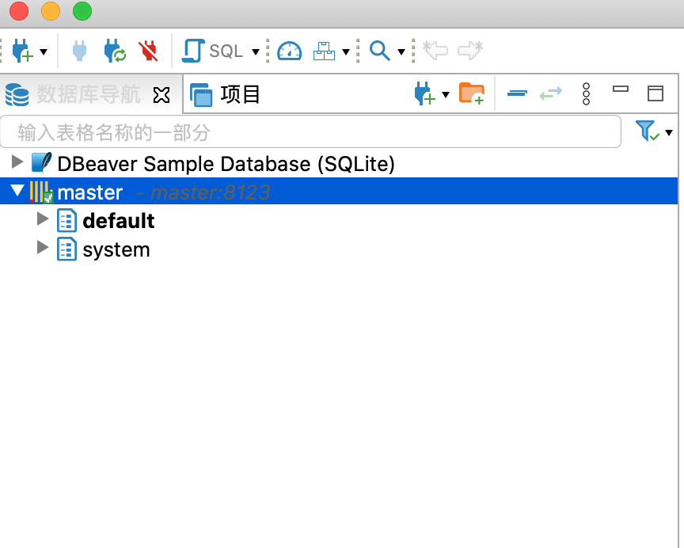

# Ubuntu 20.04搭建大数据集群

[TOC]


## 前言

### 虚拟机配置

| 系统         | 内存 | cpu  | 硬盘 | hostname | 安装服务                                                     |
| ------------ | ---- | ---- | ---- | -------- | ------------------------------------------------------------ |
| Ubuntu 20.04 | 10G  | 2核  | 300G | master   | Hadoop：namenode，datanode，journal，zkfc；Yarn：resourceManager，nodeManager；Flink：JobManager，TaskManager；Mysql；Hive；Clickhouse；Zookeeper； |
| Ubuntu 20.04 | 6G   | 2核  | 300G | slave1   | Hadoop：namenode，datanode，journal，zkfc；Yarn：resourceManager，nodeManager；Flink：JobManager，TaskManager；Zookeeper； |
| Ubuntu 20.04 | 6G   | 2核  | 300G | Slave2   | Hadoop：namenode，datanode，journal，zkfc；Yarn：resourceManager，nodeManager；Flink：TaskManager；Zookeeper； |

### 服务版本

| 服务名称   | 版本号  |
| ---------- | ------- |
| Zookeeper  | 3.5.9   |
| Hadoop     | 3.2.2   |
| Mysql      | 5.7     |
| Hive       | 3.1.2   |
| Flink      | 1.12.0  |
| Clickhouse | 18.16.1 |

## 前置环境

### 静态ip配置

编辑netplan配置文件：

```shell
sudo vim /etc/netplan/00-installer-config.yaml
```

按照自己的需要在三台机器进行修改：

```yaml
# This is the network config written by 'subiquity'
network:
  ethernets:
    ens33:
      # 原为true，将此处修改为false
      dhcp4: no
      # ip地址 /24意思：举例说吧，192.168.0.0/24”就表示，这个网段的IP地址从192.168.0.1开始，到192.168.0.254结束（192.168.0.0和192.168.0.255有特殊含义，不能用作IP地址）；子网掩码是255.255.255.0。
# 上面的子网掩码怎么来的呢?其实关键就在“24”上。我们知道IP地址是四个十进制数组成的，相当于32位二进制。
      addresses: [192.168.0.105/24]
      
      optional: true
      # 网关
      gateway4: 192.168.0.10
      # DNS
      nameservers:
              addresses: [192.168.0.10,192.168.1.1,223.5.5.5,223.6.6.6]
  version: 2
```

编辑完配置文件之后进行应用：

```shell
sudo netplan apply
```

### JDK安装

使用系统自带的openjdk，安装命令：

```shell
sudo apt updatesudo apt install openjdk-8-jdk
```

### SSH免密登陆配置

修改hosts文件

```
192.168.0.105	master
192.168.0.103	slave1
192.168.0.104   slave2
```

生成ssh-key

```shell
ssh-keygen
```

执行成功后一路回车。在~/.ssh目录下，新建config文件，需要使用sudo

```
host    master
hostname        master
user    master
host    slave1
hostname        slave1
user    slave1
host    slave2
hostname        slave2
user    slave2
```

做完这个配置之后，使用ssh连接会更加方便。接下来对三台机器做ssh-copy-id，也包括自己

```shell
# 以下命令逐条执行
ssh-copy-id master
ssh-copy-id slave1
ssh-copy-id slave2
```

**注意：以上操作需要在三台机器上分别做配置**

## 环境搭建

### Zookeeper

首先需要搭建的就是zookeeper服务，因为他是大数据集群的管理员。这里用到的zookeeper版本为3.5.9，可以从apache官网直接下载。

1. 将下载好的tar包进行解压，将conf目录下的zoo_sample.cfg复制一份名为zoo.cfg的文件，进行修改：主要修改dataDir和server集群节点配置

   ```properties
   # the directory where the snapshot is stored.
   # do not use /tmp for storage, /tmp here is just 
   # example sakes.
   # 主要修改dataDir，即数据存放目录，指定目录如果没有，需要手动创建
   dataDir=/usr/local/software/apache-zookeeper-3.5.9-bin/data
   # the port at which the clients will connect
   clientPort=2181
   # the maximum number of client connections.
   # increase this if you need to handle more clients
   #maxClientCnxns=60
   #
   # Be sure to read the maintenance section of the 
   # administrator guide before turning on autopurge.
   #
   # http://zookeeper.apache.org/doc/current/zookeeperAdmin.html#sc_maintenance
   #
   # The number of snapshots to retain in dataDir
   #autopurge.snapRetainCount=3
   # Purge task interval in hours
   # Set to "0" to disable auto purge feature
   #autopurge.purgeInterval=1
   # 集群节点配置
   server.0=master:2888:3888
   server.1=slave1:2888:3888
   server.2=slave2:2888:3888
   ```

2. 在zoo.cfg中配置的dataDir下面新建myid文件，并按server节点配置写入id需要。如server.0节点写0，server.1节点写1，server.2节点写2

3. 修改系统环境变量，由于我系统中安装了oh-myzsh，所以需要修改~/.zshrc文件，修改完配置文件之后使用source 命令进行更新。

   ```shell
   export ZOOKEEPER_HOME=/usr/local/software/apache-zookeeper-3.5.9-bin
   # 注意，如果系统环境变量中已有PATH，将zookeeper目录添加上即可。不可直接复制，粘贴！！！！！！！！
   export PATH=$PATH:$ZOOKEEPER_HOME/bin
   ```

4. 启动测试，以此在三台机器上执行zkServer.sh start命令，会出现如下日志。如果出现异常日志，需要查看logs目录下的日志文件，找到问题所在并解决之后再尝试启动。

   ```
   /usr/bin/java
   ZooKeeper JMX enabled by default
   Using config: /usr/local/software/apache-zookeeper-3.5.9-bin/bin/../conf/zoo.cfg
   Starting zookeeper ... STARTED
   ```

5. 三台机器都启动完成之后，使用zkServer.sh status命令，查看启动是否成功以及集群节点状态，如果都成功之后，三个节点中会有一个节点的Mode为leader，另外两个节点的Model为follower

   ```
   /usr/bin/java
   ZooKeeper JMX enabled by default
   Using config: /usr/local/software/apache-zookeeper-3.5.9-bin/bin/../conf/zoo.cfg
   Client port found: 2181. Client address: localhost. Client SSL: false.
   Mode: leader
   ```

### Hadoop

接着我们搭建Hadoop服务，用的是Hadoop3.2.2的版本。安装包同样在Apache的官网下载即可。

#### 修改配置文件

配置文件目录：$HADOOP_HOME/etc/hadoop

1. core-site.xml，文件中目录相关需依实际情况进行配置，如果没有要进行创建

   ```xml
   <?xml version="1.0" encoding="UTF-8"?>
   <?xml-stylesheet type="text/xsl" href="configuration.xsl"?>
   <!--
     Licensed under the Apache License, Version 2.0 (the "License");
     you may not use this file except in compliance with the License.
     You may obtain a copy of the License at
   
       http://www.apache.org/licenses/LICENSE-2.0
   
     Unless required by applicable law or agreed to in writing, software
     distributed under the License is distributed on an "AS IS" BASIS,
     WITHOUT WARRANTIES OR CONDITIONS OF ANY KIND, either express or implied.
     See the License for the specific language governing permissions and
     limitations under the License. See accompanying LICENSE file.
   -->
   
   <!-- Put site-specific property overrides in this file. -->
   
   <configuration>
           <!-- 用来指定hdfs的老大，ns为苦丁属性名，表示两个namenode-->
           <property>
                   <name>fs.defaultFS</name>
                   <value>hdfs://ns</value>
           </property>
           <!-- 用来指定hadoop运行时产生文件的存放目录-->
           <property>
                   <name>hadoop.tmp.dir</name>
             			<!--此目录要根据实际进行配置-->
                   <value>/usr/local/software/hadoop-3.2.2/tmp</value>
           </property>
           <property>
                   <name>ha.zookeeper.quorum</name>
                   <value>master:2181,slave1:2181,slave2:2181</value>
           </property>
   </configuration>
   ```

2. hadoop-env.sh，只需要添加一个jdk的配置，JAVA_HOME要根据实际情况进行配置，如果是使用apt安装的openjdk则JAVA_HOME为如下配置：

   ```shell
   export JAVA_HOME=/usr/lib/jvm/java-8-openjdk-amd64
   ```

3. hdfs-site.xml，文件中目录相关需依实际情况进行配置，如果没有要进行创建；注意：hadoop2.x的端口与hadoop3.x的端口有区别，此配置为hadoop3.x。

   ```xml
   <?xml version="1.0" encoding="UTF-8"?>
   <?xml-stylesheet type="text/xsl" href="configuration.xsl"?>
   <!--
     Licensed under the Apache License, Version 2.0 (the "License");
     you may not use this file except in compliance with the License.
     You may obtain a copy of the License at
   
       http://www.apache.org/licenses/LICENSE-2.0
   
     Unless required by applicable law or agreed to in writing, software
     distributed under the License is distributed on an "AS IS" BASIS,
     WITHOUT WARRANTIES OR CONDITIONS OF ANY KIND, either express or implied.
     See the License for the specific language governing permissions and
     limitations under the License. See accompanying LICENSE file.
   -->
   
   <!-- Put site-specific property overrides in this file. -->
   
   <configuration>
           <!--执行hdfs的nameservice为ns，和core-site保持一致-->
           <property>
                   <name>dfs.nameservices</name>
                   <value>ns</value>
           </property>
           <!--ns有三个namenode分别是nn1,nn2,nn3，Hadoop3.x可以多个namenode-->
           <property>
                   <name>dfs.ha.namenodes.ns</name>
                   <value>nn1,nn2,nn3</value>
           </property>
           <property>
                   <name>dfs.namenode.rpc-address.ns.nn1</name>
                   <value>master:8020</value>
           </property>
           <property>
                   <name>dfs.namenode.http-address.ns.nn1</name>
                   <value>master:9870</value>
           </property>
           <property>
                   <name>dfs.namenode.rpc-address.ns.nn2</name>
                   <value>slave1:8020</value>
           </property>
           <property>
                   <name>dfs.namenode.http-address.ns.nn2</name>
                   <value>slave1:9870</value>
           </property>
           <property>
                   <name>dfs.namenode.rpc-address.ns.nn3</name>
                   <value>slave2:8020</value>
           </property>
           <property>
                   <name>dfs.namenode.http-address.ns.nn3</name>
                   <value>slave3:9870</value>
           </property>
           <!--指定namenode的元数据在JournalNode上存放位置，这样其它namenode可以从jn集群里获取最新的namenode信息，达到热备效果-->
           <property>
                   <name>dfs.namenode.shared.edits.dir</name>
                   <value>qjournal://master:8485;slave1:8485;slave2:8485/ns</value>
           </property>
           <!--指定JournalNode存放数据的位置-->
           <property>
                   <name>dfs.journalnode.edits.dir</name>
                   <value>/usr/local/software/hadoop-3.2.2/journal</value>
           </property>
           <!--开启namenode故障自动切换-->
           <property>
                   <name>dfs.ha.automatic-failover.enabled</name>
                   <value>true</value>
           </property>
           <!--配置切换方式-->
           <property>
                   <name>dfs.client.failover.proxy.provider.ns</name>
                   <value>org.apache.hadoop.hdfs.server.namenode.ha.ConfiguredFailoverProxyProvider</value>
           </property>
           <!--配置隔离机制-->
           <property>
                   <name>dfs.ha.fencing.methods</name>
                   <value>sshfence</value>
           </property>
           <!--配置隔离机制的ssh登陆秘钥所在位置，此处按实际情况进行配置-->
           <property>
                   <name>dfs.ha.fencing.ssh.private-key-files</name>
                   <value>/home/master/.ssh/id_rsa</value>
           </property>
           <!--配置namenode数据存放位置，可以不配置，如果不配置，默认用的是core-site里面的hadoop.tmp.dir的路径-->
           <property>
                   <name>dfs.namenode.name.dir</name>
                   <value>file:////usr/local/software/hadoop-3.2.2/tmp/namenode</value>
           </property>
           <!--配置datanode数据存放位置，可以不配置，如果不配置，默认用的是core-site里面配置的hadoop.tmp.dir的路径-->
           <property>
                   <name>dfs.datanode.data.dir</name>
                   <value>file:////usr/local/software/hadoop-3.2.2/tmp/datanode</value>
           </property>
           <!--配置block副本数量-->
           <property>
                   <name>dfs.replication</name>
                   <value>3</value>
           </property>
           <!--配置hdfs的操作权限，false表示任何用户都可以在hdfs上操作文件-->
           <property>
                   <name>dfs.permissions</name>
                   <value>false</value>
           </property>
   </configuration>
   ```

4. mapred-site.xml

   ```xml
   <!--
     Licensed under the Apache License, Version 2.0 (the "License");
     you may not use this file except in compliance with the License.
     You may obtain a copy of the License at
   
       http://www.apache.org/licenses/LICENSE-2.0
   
     Unless required by applicable law or agreed to in writing, software
     distributed under the License is distributed on an "AS IS" BASIS,
     WITHOUT WARRANTIES OR CONDITIONS OF ANY KIND, either express or implied.
     See the License for the specific language governing permissions and
     limitations under the License. See accompanying LICENSE file.
   -->
   
   <!-- Put site-specific property overrides in this file. -->
   
   <configuration>
           <!--指定mapreduce运行在yarn上-->
           <property>
                   <name>mapreduce.framework.name</name>
                   <value>yarn</value>
           </property>
           <property>
                   <name>yarn.app.mapreduce.am.env</name>
                   <value>HADOOP_MAPRED_HOME=${HADOOP_HOME}</value>
           </property>
           <property>
                   <name>mapreduce.map.env</name>
                   <value>HADOOP_MAPRED_HOME=${HADOOP_HOME}</value>
            </property>
            <property>
                   <name>mapreduce.reduce.env</name>
                   <value>HADOOP_MAPRED_HOME=${HADOOP_HOME}</value>
             </property>
   </configuration>
   ```

5. yarn-env.sh，同样只需要添加JAVA_HOME配置

   ```shell
   export JAVA_HOME=/usr/lib/jvm/java-8-openjdk-amd64
   ```

6. yarn-site.xml

   ```xml
   <?xml version="1.0"?>
   <!--
     Licensed under the Apache License, Version 2.0 (the "License");
     you may not use this file except in compliance with the License.
     You may obtain a copy of the License at
   
       http://www.apache.org/licenses/LICENSE-2.0
   
     Unless required by applicable law or agreed to in writing, software
     distributed under the License is distributed on an "AS IS" BASIS,
     WITHOUT WARRANTIES OR CONDITIONS OF ANY KIND, either express or implied.
     See the License for the specific language governing permissions and
     limitations under the License. See accompanying LICENSE file.
   -->
   <configuration>
           <!--开启yarn ha-->
           <property>
                   <name>yarn.resourcemanager.ha.enabled</name>
                   <value>true</value>
           </property>
           <!--指定两个resourcemanager的名称-->
           <property>
                   <name>yarn.resourcemanager.ha.rm-ids</name>
                   <value>rm1,rm2,rm3</value>
           </property>
           <!--配置rm1,rm2,rm3-->
           <property>
                   <name>yarn.resourcemanager.hostname.rm1</name>
                   <value>master</value>
           </property>
           <property>
                   <name>yarn.resourcemanager.hostname.rm2</name>
                   <value>slave1</value>
           </property>
           <property>
                   <name>yarn.resourcemanager.hostname.rm3</name>
                   <value>slave2</value>
           </property>
     			<property>
                   <name>yarn.resourcemanager.webapp.address.rm1</name>
                   <value>master:8088</value>
           </property>
           <property>
                   <name>yarn.resourcemanager.webapp.address.rm2</name>
                   <value>slave1:8088</value>
           </property>
           <property>
                   <name>yarn.resourcemanager.webapp.address.rm3</name>
                   <value>slave2:8088</value>
           </property>
           <property>
                   <name>yarn.resourcemanager.scheduler.address.rm1</name>
                   <value>master:8030</value>
           </property>
           <!--开启yarn恢复机制-->
           <property>
                   <name>yarn.resourcemanager.recovery.enabled</name>
                   <value>true</value>
           </property>
           <!--执行rm恢复机制实现类-->
           <property>
                   <name>yarn.resourcemanager.store.class</name>
                   <value>org.apache.hadoop.yarn.server.resourcemanager.recovery.ZKRMStateStore</value>
           </property>
           <!--配置zookeeper地址-->
           <property>
                   <name>yarn.resourcemanager.zk-address</name>
                   <value>master:2181,slave1:2181,slave:2181</value>
           </property>
           <!--指定yarn ha名称-->
           <property>
                   <name>yarn.resourcemanager.cluster-id</name>
                   <value>yarn-ha</value>
           </property>
           <!--指定yarn的master，ResourceManager的地址-->
           <property>
                   <name>yarn.resourcemanager.hostname</name>
                   <value>master</value>
           </property>
           <!--NodeManager获取数据的方式-->
           <property>
                   <name>yarn.nodemanager.aux-services</name>
                   <value>mapreduce_shuffle</value>
           </property>
   </configuration>
   ```

7. workers，需要添加节点的host

   ```
   master
   slave1
   slave2
   ```

**注意：以上配置中的目录，如果没有的需要自行创建**

以上内容配置完成之后，复制到其它节点，不同的地方需要做相应的配置，如ssh-key的配置。

#### 配置环境变量

依据实际情况进行如下配置：

```shell
export ZOOKEEPER_HOME=/usr/local/software/apache-zookeeper-3.5.9-bin
export HADOOP_HOME=/usr/local/software/hadoop-3.2.2
export PATH=$PATH:$ZOOKEEPER_HOME/bin:$HADOOP_HOME/bin:$HADOOP_HOME/sbin
```

#### 服务启动

如果执行如下命令出现错误，查看日志，是否配置有误或者防火墙等未关闭

```shell
# journalnode的节点都执行该命令
hdfs --daemon start journalnode
# 格式化，在其中一台namenode虚拟机执行即可
hdfs namenode -format  
# 启动namenode
hdfs --daemon start namenode 
# 副节点同步主节点格式化文件
hdfs namenode -bootstrapStandby 
其余namenode节点执行该命令
# 格式化zkfc，在其中一台namenode虚拟机执行即可
hdfs zkfc -formatZK   
sbin/stop-dfs.sh
sbin/start-dfs.sh
start-yarn.sh
```

全部成功启动之后，hadoop-web访问主节点：http://master:9870



Yarn-web访问主节点：http://master:8088



### Hive

我们继续搭建hive服务，这里使用的是hive3.1.2版本，同样可以在Apache官网进行下载。

#### 修改配置文件

1. hive-env.sh，需要配置HADOOP_HOME，根据实际目录进行配置；如果没有此文件的话，就复制一份儿hive-env.sh.template再进行此修改。

   ```shell
   HADOOP_HOME=/usr/local/software/hadoop-3.2.2
   ```

2. hive-site.xml，这里主要配置mysql的连接方式，如没有此文件，需要新建后进行配置，此文件需依实际情况进行配置。**注意：这里前置要求，需要启动mysql，并在mysql中创建名为hive的数据库。**

   ```xml
   <configuration>
     <property>
       <name>javax.jdo.option.ConnectionURL</name>
       <value>jdbc:mysql://master:3306/hive?useSSL=false</value>
     </property>
     <property>
       <name>javax.jdo.option.ConnectionDriverName</name>
       <value>com.mysql.jdbc.Driver</value>
     </property>
     <property>
       <name>javax.jdo.option.ConnectionUserName</name>
       <value>root</value>
     </property>
     <property>
       <name>javax.jdo.option.ConnectionPassword</name>
       <value>root</value>
     </property>
   </configuration>
   ```

#### jar包依赖

1. Mysql-jdbc的依赖：**mysql**-connector-java-*.jar需要将此jar包下载下来放到hive的lib目录下。这里的jar包版本依实际情况。

2. guavajar包冲突，导致hive启动等报错，需解决。将hive/lib目录中原来的guava jar包删除，然后把hadoop下的guava的jar包拷贝到hive的lib目录中即可。

   ```shell
   cp hadoop-3.2.2/share/hadoop/common/lib/guava-27.0-jre.jar hive/lib
   ```

#### 配置环境变量

依据实际目录进行配置

```shell
export ZOOKEEPER_HOME=/usr/local/software/apache-zookeeper-3.5.9-bin
export HADOOP_HOME=/usr/local/software/hadoop-3.2.2
export HIVE_HOME=/usr/local/software/apache-hive-3.1.2-bin
export PATH=$PATH:$ZOOKEEPER_HOME/bin:$HADOOP_HOME/bin:$HADOOP_HOME/sbin:$HIVE_HOME/bin
```

#### 初始化数据

执行完，不报错，即为执行成功。如果报错，请检查上述操作。

```shell
schematool -dbType mysql -initSchema
```

#### 验证

如果不报错，即为成功，如有报错，根据提示自行解决。

```shell
# 执行hive命令即可进入
hive
```

下载数据进行验证，数据下载完毕，使用unzip进行解压

```shell
wget http://files.grouplens.org/datasets/movielens/ml-100k.zip
```

新建创建表hql脚本hiveExample.sql

```sql
CREATE TABLE IF NOT EXISTS u_data (
        userid INT,
        movieid INT,
        rating INT,
        unixtime STRING)
ROW FORMAT DELIMITED
FIELDS TERMINATED BY '\t'
STORED AS TEXTFILE;

CREATE TABLE IF NOT EXISTS u_user(
        userid INT,
        age  INT,
        gender STRING,
        occupation STRING ,
        zipcode INT)
ROW FORMAT DELIMITED
FIELDS TERMINATED BY '|'
STORED AS TEXTFILE;

CREATE TABLE IF NOT EXISTS u_item(
        movieid INT,
        movietitle STRING,
        releasedate  STRING,
        videoreleasedate STRING,
        IMDbURL STRING,
        unknown  INT,
        Action INT,
        Adventure  INT,
        Animation INT,
        Childrens INT,
        Comedy INT,
        Crime INT,
        Documentary INT,
        Drama INT,
        Fantasy INT,
        FilmNoir INT,
        Horror INT,
        Musical INT,
        Mystery INT,
        Romance INT,
        SciFi INT,
        Thriller INT,
        War INT,
        Western INT)
ROW FORMAT DELIMITED
FIELDS TERMINATED BY '|'
STORED AS TEXTFILE;
```

执行创建表hql脚本：

```shell
hive -f hiveExample.sql
```

创建导入数据hql脚本，importData.sql

```shell
LOAD DATA LOCAL INPATH '/home/master/ml-100k/u.data' OVERWRITE INTO TABLE u_data; 
LOAD DATA LOCAL INPATH '/home/master/ml-100k/u.user' OVERWRITE INTO TABLE u_user;
LOAD DATA LOCAL INPATH '/home/master/ml-100k/u.item' OVERWRITE INTO TABLE u_item;
```

执行导入数据hql脚本：

```shell
hive -f importData.sql
```

执行查询语句进行测试：

```sql
select u.userid,count(d.movieid) movie_num from u_user u left join u_data d on u.userid=d.userid group by u.userid order by movie_num desc limit 10;
```

如果执行完成，没有报错，会在yarn的web页面中会有相应的执行记录和结果；如果有报错请根据错误提示进行解决。

### Flink

这里使用的是Flink-1.12.0版本，安装包可从Apache官网进行下载。

#### 修改配置

1. zoo.cfg，这里主要配置zookeeper集群的连接方式。根据实际情况进行配置。

   ```shell
   ################################################################################
   #  Licensed to the Apache Software Foundation (ASF) under one
   #  or more contributor license agreements.  See the NOTICE file
   #  distributed with this work for additional information
   #  regarding copyright ownership.  The ASF licenses this file
   #  to you under the Apache License, Version 2.0 (the
   #  "License"); you may not use this file except in compliance
   #  with the License.  You may obtain a copy of the License at
   #
   #      http://www.apache.org/licenses/LICENSE-2.0
   #
   #  Unless required by applicable law or agreed to in writing, software
   #  distributed under the License is distributed on an "AS IS" BASIS,
   #  WITHOUT WARRANTIES OR CONDITIONS OF ANY KIND, either express or implied.
   #  See the License for the specific language governing permissions and
   # limitations under the License.
   ################################################################################
   
   # The number of milliseconds of each tick
   tickTime=2000
   
   # The number of ticks that the initial  synchronization phase can take
   initLimit=10
   
   # The number of ticks that can pass between  sending a request and getting an acknowledgement
   syncLimit=5
   
   # The directory where the snapshot is stored.
   # dataDir=/tmp/zookeeper
   
   # The port at which the clients will connect
   clientPort=2181
   
   # ZooKeeper quorum peers
   server.0=master:2888:3888
   server.1=slave1:2888:3888
   server.2=slave2:2888:3888
   # server.2=host:peer-port:leader-port
   ```

2. workers，这里主要配置所有的TaskManager节点。根据实际情况进行配置。

   ```shell
   master
   slave1
   slave2
   ```

3. masters，这里主要配置所有的JobManager节点。根据实际情况进行配置。**注意：以下配置中关于hdfs存储的地方会和hadoop版本有相映的差异，主要在hadoop2.x和hadoop3.x端口的差异；其中hadoop2.x namenode端口为9000，而hadoop3.x namenode端口为8020。如有端口不对，请查看hadoop中的hdfs-site.xml文件中的配置。flink-ha模式中jobmanager.rpc.address此处配置在不同节点稍有不同，详情请看以下配置文件中的注释。**

   ```yaml
   ################################################################################
   #  Licensed to the Apache Software Foundation (ASF) under one
   #  or more contributor license agreements.  See the NOTICE file
   #  distributed with this work for additional information
   #  regarding copyright ownership.  The ASF licenses this file
   #  to you under the Apache License, Version 2.0 (the
   #  "License"); you may not use this file except in compliance
   #  with the License.  You may obtain a copy of the License at
   #
   #      http://www.apache.org/licenses/LICENSE-2.0
   #
   #  Unless required by applicable law or agreed to in writing, software
   #  distributed under the License is distributed on an "AS IS" BASIS,
   #  WITHOUT WARRANTIES OR CONDITIONS OF ANY KIND, either express or implied.
   #  See the License for the specific language governing permissions and
   # limitations under the License.
   ################################################################################
   
   
   #==============================================================================
   # Common
   #==============================================================================
   
   # The external address of the host on which the JobManager runs and can be
   # reached by the TaskManagers and any clients which want to connect. This setting
   # is only used in Standalone mode and may be overwritten on the JobManager side
   # by specifying the --host <hostname> parameter of the bin/jobmanager.sh executable.
   # In high availability mode, if you use the bin/start-cluster.sh script and setup
   # the conf/masters file, this will be taken care of automatically. Yarn/Mesos
   # automatically configure the host name based on the hostname of the node where the
   # JobManager runs.
   # 此处需根据masters文件内容，在相应的节点修改成不同的host；如masters文件中配置为master slave1，则在slave1节点中此处要配置为slave1。
   jobmanager.rpc.address: master
   
   # The RPC port where the JobManager is reachable.
   
   jobmanager.rpc.port: 6123
   
   
   # The total process memory size for the JobManager.
   # Note this accounts for all memory usage within the JobManager process, including JVM metaspace and other overhead.
   
   jobmanager.memory.process.size: 1600m
   
   
   # The total process memory size for the TaskManager.
   #
   # Note this accounts for all memory usage within the TaskManager process, including JVM metaspace and other overhead.
   
   taskmanager.memory.process.size: 1728m
   
   # To exclude JVM metaspace and overhead, please, use total Flink memory size instead of 'taskmanager.memory.process.size'.
   # It is not recommended to set both 'taskmanager.memory.process.size' and Flink memory.
   #
   # taskmanager.memory.flink.size: 1280m
   
   # The number of task slots that each TaskManager offers. Each slot runs one parallel pipeline.
   
   taskmanager.numberOfTaskSlots: 1
   
   # The parallelism used for programs that did not specify and other parallelism.
   
   parallelism.default: 1
   
   # The default file system scheme and authority.
   # 
   # By default file paths without scheme are interpreted relative to the local
   # root file system 'file:///'. Use this to override the default and interpret
   # relative paths relative to a different file system,
   # for example 'hdfs://mynamenode:12345'
   #
   # fs.default-scheme
   #==============================================================================
   # High Availability
   #==============================================================================
   
   # The high-availability mode. Possible options are 'NONE' or 'zookeeper'.
   #
   high-availability: zookeeper
   
   # The path where metadata for master recovery is persisted. While ZooKeeper stores
   # the small ground truth for checkpoint and leader election, this location stores
   # the larger objects, like persisted dataflow graphs.
   # 
   # Must be a durable file system that is accessible from all nodes
   # (like HDFS, S3, Ceph, nfs, ...) 
   #
   high-availability.storageDir: hdfs://master:8020/flink/ha/
   
   # The list of ZooKeeper quorum peers that coordinate the high-availability
   # setup. This must be a list of the form:
   # "host1:clientPort,host2:clientPort,..." (default clientPort: 2181)
   #
   high-availability.zookeeper.quorum: master:2181,slave1:2181,slave2:2181
   
   
   # ACL options are based on https://zookeeper.apache.org/doc/r3.1.2/zookeeperProgrammers.html#sc_BuiltinACLSchemes
   # It can be either "creator" (ZOO_CREATE_ALL_ACL) or "open" (ZOO_OPEN_ACL_UNSAFE)
   # The default value is "open" and it can be changed to "creator" if ZK security is enabled
   #
   # high-availability.zookeeper.client.acl: open
   
   #==============================================================================
   # Fault tolerance and checkpointing
   #==============================================================================
   
   # The backend that will be used to store operator state checkpoints if
   # checkpointing is enabled.
   # Supported backends are 'jobmanager', 'filesystem', 'rocksdb', or the
   # <class-name-of-factory>.
   #
   state.backend: filesystem
   
   # Directory for checkpoints filesystem, when using any of the default bundled
   # state backends.
   #
   state.checkpoints.dir: hdfs://master:8020/flink-checkpoints
   
   # Default target directory for savepoints, optional.
   #
   # state.savepoints.dir: hdfs://namenode-host:port/flink-savepoints
   
   # Flag to enable/disable incremental checkpoints for backends that
   # support incremental checkpoints (like the RocksDB state backend). 
   #
   # state.backend.incremental: false
   
   # The failover strategy, i.e., how the job computation recovers from task failures.
   # Only restart tasks that may have been affected by the task failure, which typically includes
   # downstream tasks and potentially upstream tasks if their produced data is no longer available for consumption.
   
   jobmanager.execution.failover-strategy: region
   
   #==============================================================================
   # Rest & web frontend
   #==============================================================================
   
   # The port to which the REST client connects to. If rest.bind-port has
   # not been specified, then the server will bind to this port as well.
   #
   rest.port: 8081
   # The address to which the REST client will connect to
   #
   #rest.address: 0.0.0.0
   
   # Port range for the REST and web server to bind to.
   #
   #rest.bind-port: 8080-8090
   
   # The address that the REST & web server binds to
   #
   #rest.bind-address: 0.0.0.0
   
   # Flag to specify whether job submission is enabled from the web-based
   # runtime monitor. Uncomment to disable.
   
   #web.submit.enable: false
   
   #==============================================================================
   # Advanced
   #==============================================================================
   
   # Override the directories for temporary files. If not specified, the
   # system-specific Java temporary directory (java.io.tmpdir property) is taken.
   #
   # For framework setups on Yarn or Mesos, Flink will automatically pick up the
   # containers' temp directories without any need for configuration.
   #
   # Add a delimited list for multiple directories, using the system directory
   # delimiter (colon ':' on unix) or a comma, e.g.:
   #     /data1/tmp:/data2/tmp:/data3/tmp
   #
   # Note: Each directory entry is read from and written to by a different I/O
   # thread. You can include the same directory multiple times in order to create
   # multiple I/O threads against that directory. This is for example relevant for
   # high-throughput RAIDs.
   #
   # io.tmp.dirs: /tmp
   # The classloading resolve order. Possible values are 'child-first' (Flink's default)
   # and 'parent-first' (Java's default).
   #
   # Child first classloading allows users to use different dependency/library
   # versions in their application than those in the classpath. Switching back
   # to 'parent-first' may help with debugging dependency issues.
   #
   # classloader.resolve-order: child-first
   
   # The amount of memory going to the network stack. These numbers usually need 
   # no tuning. Adjusting them may be necessary in case of an "Insufficient number
   # of network buffers" error. The default min is 64MB, the default max is 1GB.
   # 
   # taskmanager.memory.network.fraction: 0.1
   # taskmanager.memory.network.min: 64mb
   # taskmanager.memory.network.max: 1gb
   
   #==============================================================================
   # Flink Cluster Security Configuration
   #==============================================================================
   
   # Kerberos authentication for various components - Hadoop, ZooKeeper, and connectors -
   # may be enabled in four steps:
   # 1. configure the local krb5.conf file
   # 2. provide Kerberos credentials (either a keytab or a ticket cache w/ kinit)
   # 3. make the credentials available to various JAAS login contexts
   # 4. configure the connector to use JAAS/SASL
   
   # The below configure how Kerberos credentials are provided. A keytab will be used instead of
   # a ticket cache if the keytab path and principal are set.
   
   # security.kerberos.login.use-ticket-cache: true
   # security.kerberos.login.keytab: /path/to/kerberos/keytab
   # security.kerberos.login.principal: flink-user
   
   # The configuration below defines which JAAS login contexts
   
   # security.kerberos.login.contexts: Client,KafkaClient
   #==============================================================================
   # ZK Security Configuration
   #==============================================================================
   
   # Below configurations are applicable if ZK ensemble is configured for security
   
   # Override below configuration to provide custom ZK service name if configured
   # zookeeper.sasl.service-name: zookeeper
   
   # The configuration below must match one of the values set in "security.kerberos.login.contexts"
   # zookeeper.sasl.login-context-name: Client
   
   #==============================================================================
   # HistoryServer
   #==============================================================================
   
   # The HistoryServer is started and stopped via bin/historyserver.sh (start|stop)
   
   # Directory to upload completed jobs to. Add this directory to the list of
   # monitored directories of the HistoryServer as well (see below).
   #jobmanager.archive.fs.dir: hdfs:///completed-jobs/
   
   # The address under which the web-based HistoryServer listens.
   #historyserver.web.address: 0.0.0.0
   
   # The port under which the web-based HistoryServer listens.
   #historyserver.web.port: 8082
   
   # Comma separated list of directories to monitor for completed jobs.
   #historyserver.archive.fs.dir: hdfs:///completed-jobs/
   
   # Interval in milliseconds for refreshing the monitored directories.
   #historyserver.archive.fs.refresh-interval: 10000
   ```

全部配置完成之后，拷贝到其它节点，配置环境变量，更改配置等。

#### 下载缺少依赖包

如果使用的是hadoop2.x版本，请下载flink-shaded-hadoop2-uber对应当前flink版本的jar包，存放到flink的lib目录下。（可在apache flink官网进行下载）

如果使用的是hadoop3.x版本，请下载flink-shaded-hadoop3-uber对应当前flink版本的jar包，存放到flink的lib目录下。其次还需要下载commons-cli-1.4将其放到flink的lib目录下，commons-cli为apache版本，可在maven仓库中下载。

#### 配置环境变量

请根据自己实际目录进行配置，配置完成进行source

```shell
export ZOOKEEPER_HOME=/usr/local/software/apache-zookeeper-3.5.9-bin
export HADOOP_HOME=/usr/local/software/hadoop-3.2.2
export HADOOP_MAPRED_HOME=$HADOOP_HOME
export HIVE_HOME=/usr/local/software/apache-hive-3.1.2-bin
export FLINK_HOME=/usr/local/software/flink-1.12.0
export PATH=$PATH:$ZOOKEEPER_HOME/bin:$HADOOP_HOME/bin:$HADOOP_HOME/sbin:$HIVE_HOME/bin:$FLINK_HOME/bin
```

#### 启动测试

##### 启动集群：

```shell
start-cluster.sh
```

查看flink/log目录下日志，是否有报错，如果报错请根据提示解决。

启动成功后可访问http://master:8081，查看flink web-ui页面







##### 测试flink-on-yarn

在flink/examples/batch目录下面有很多示例，选择一个可进行测试：

```shell
# 提交到yarn-cluster执行
flink run -m yarn-cluster KMeans.jar
```

执行成功之后，可在yarn的web页面中查看执行记录





### Clickhouse

按照clickhouse官网文档的安装教程，进行安装：

#### 安装[ ](https://clickhouse.tech/docs/zh/getting-started/install/#clickhouse-an-zhuang)

#### 系统要求[ ](https://clickhouse.tech/docs/zh/getting-started/install/#xi-tong-yao-qiu)

ClickHouse可以在任何具有x86_64，AArch64或PowerPC64LE CPU架构的Linux，FreeBSD或Mac OS X上运行。

官方预构建的二进制文件通常针对x86_64进行编译，并利用`SSE 4.2`指令集，因此，除非另有说明，支持它的CPU使用将成为额外的系统需求。下面是检查当前CPU是否支持SSE 4.2的命令:

```
$ grep -q sse4_2 /proc/cpuinfo && echo "SSE 4.2 supported" || echo "SSE 4.2 not supported"
```

要在不支持`SSE 4.2`或`AArch64`，`PowerPC64LE`架构的处理器上运行ClickHouse，您应该通过适当的配置调整从[源代码构建ClickHouse](https://clickhouse.tech/docs/zh/getting-started/install/#from-sources)。

#### 可用安装包[ ](https://clickhouse.tech/docs/zh/getting-started/install/#install-from-deb-packages)

#### `DEB`安装包[ ](https://clickhouse.tech/docs/zh/getting-started/install/#deban-zhuang-bao)

建议使用Debian或Ubuntu的官方预编译`deb`软件包。运行以下命令来安装包:

```shell
sudo apt-get install apt-transport-https ca-certificates dirmngr
sudo apt-key adv --keyserver hkp://keyserver.ubuntu.com:80 --recv E0C56BD4
# 这里如果下载慢的话，可以考虑使用清华源 deb https://mirrors.tuna.tsinghua.edu.cn/clickhouse/deb/stable/ main/
echo "deb https://repo.clickhouse.tech/deb/stable/ main/" | sudo tee \
    /etc/apt/sources.list.d/clickhouse.list
sudo apt-get update

sudo apt-get install -y clickhouse-server clickhouse-client

sudo service clickhouse-server start
clickhouse-client
```

#### 修改配置文件

##### ip访问限制

/etc/clichouse-server/config.xml文件中添加如下配置：

```xml
<listen_host>::</listen_host>
```

##### 添加用户，修改密码

文件中，有详细的配置说明，配置完成后重启clickhouse服务，sudo service clickhouse-server restart

```xml
<?xml version="1.0"?>
<yandex>
    <!-- Profiles of settings. -->
    <profiles>
        <!-- Default settings. -->
        <default>
            <!-- Maximum memory usage for processing single query, in bytes. -->
            <max_memory_usage>10000000000</max_memory_usage>

            <!-- Use cache of uncompressed blocks of data. Meaningful only for processing many of very short queries. -->
            <use_uncompressed_cache>0</use_uncompressed_cache>

            <!-- How to choose between replicas during distributed query processing.
                 random - choose random replica from set of replicas with minimum number of errors
                 nearest_hostname - from set of replicas with minimum number of errors, choose replica
                  with minumum number of different symbols between replica's hostname and local hostname
                  (Hamming distance).
                 in_order - first live replica is choosen in specified order.
            -->
            <load_balancing>random</load_balancing>
        </default>

        <!-- Profile that allows only read queries. -->
        <readonly>
            <readonly>1</readonly>
        </readonly>
    </profiles>

    <!-- Users and ACL. -->
    <users>
        <!-- If user name was not specified, 'default' user is used. -->
        <default>
            <!-- Password could be specified in plaintext or in SHA256 (in hex format).

                 If you want to specify password in plaintext (not recommended), place it in 'password' element.
                 Example: <password>qwerty</password>.
Password could be empty.

                 If you want to specify SHA256, place it in 'password_sha256_hex' element.
                 Example: <password_sha256_hex>65e84be33532fb784c48129675f9eff3a682b27168c0ea744b2cf58ee02337c5</password_sha256_hex>

                 How to generate decent password:
                 Execute: PASSWORD=$(base64 < /dev/urandom | head -c8); echo "$PASSWORD"; echo -n "$PASSWORD" | sha256sum | tr -d '-'
                 In first line will be password and in second - corresponding SHA256.
            -->
            <password>default</password>

            <!-- List of networks with open access.

                 To open access from everywhere, specify:
                    <ip>::/0</ip>

                 To open access only from localhost, specify:
                    <ip>::1</ip>
                    <ip>127.0.0.1</ip>

                 Each element of list has one of the following forms:
                 <ip> IP-address or network mask. Examples: 213.180.204.3 or 10.0.0.1/8 or 10.0.0.1/255.255.255.0
                     2a02:6b8::3 or 2a02:6b8::3/64 or 2a02:6b8::3/ffff:ffff:ffff:ffff::.
                 <host> Hostname. Example: server01.yandex.ru.
                     To check access, DNS query is performed, and all received addresses compared to peer address.
                 <host_regexp> Regular expression for host names. Example, ^server\d\d-\d\d-\d\.yandex\.ru$
                     To check access, DNS PTR query is performed for peer address and then regexp is applied.
                     Then, for result of PTR query, another DNS query is performed and all received addresses compared to peer address.
                     Strongly recommended that regexp is ends with $
                 All results of DNS requests are cached till server restart.
            -->
  <networks incl="networks" replace="replace">
                <ip>::/0</ip>
            </networks>

            <!-- Settings profile for user. -->
            <profile>default</profile>

            <!-- Quota for user. -->
            <quota>default</quota>
        </default>

        <root>
           <password_sha256_hex>4813494d137e1631bba301d5acab6e7bb7aa74ce1185d456565ef51d737677b2</password_sha256_hex>
            <networks>
                <ip>::/0</ip>
            </networks>

            <!-- Settings profile for user. -->
            <profile>default</profile>

            <!-- Quota for user. -->
            <quota>default</quota>
        </root>
    </users>
 <quotas>
        <!-- Name of quota. -->
        <default>
            <!-- Limits for time interval. You could specify many intervals with different limits. -->
            <interval>
                <!-- Length of interval. -->
                <duration>3600</duration>

                <!-- No limits. Just calculate resource usage for time interval. -->
                <queries>0</queries>
                <errors>0</errors>
                <result_rows>0</result_rows>
                <read_rows>0</read_rows>
                <execution_time>0</execution_time>
            </interval>
        </default>
    </quotas>
</yandex>
```

#### 测试验证

##### clickhouse-client连接测试



##### Dbever客户端连接测试

##### 

